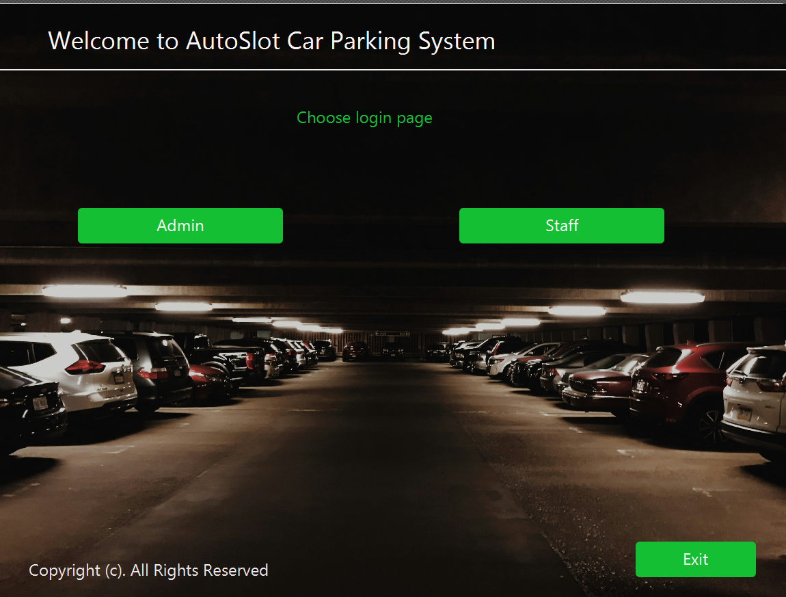
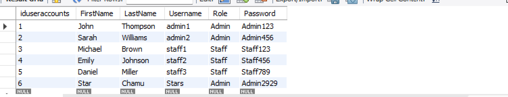
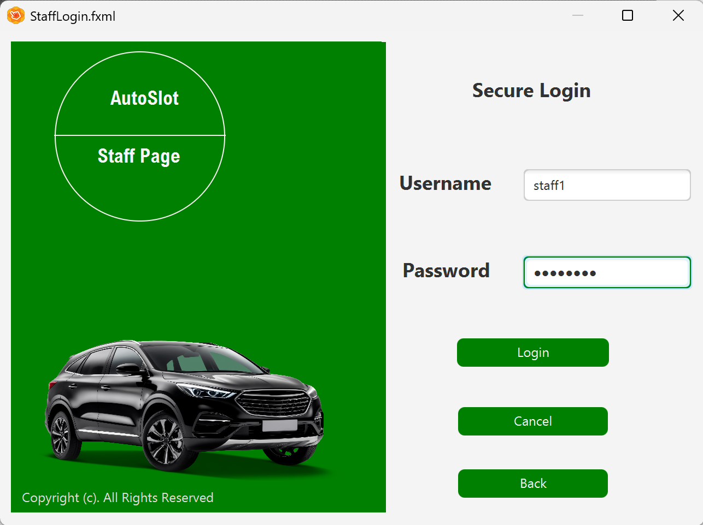
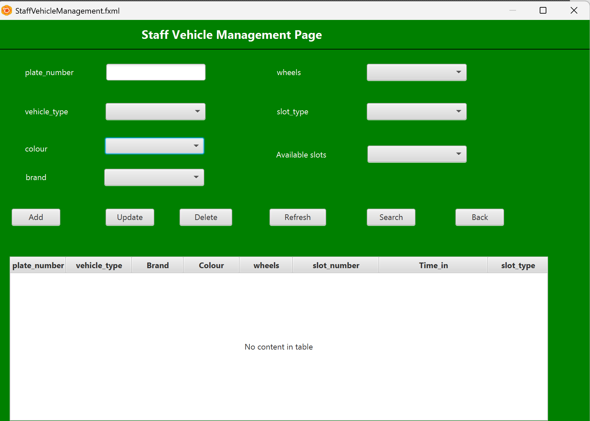
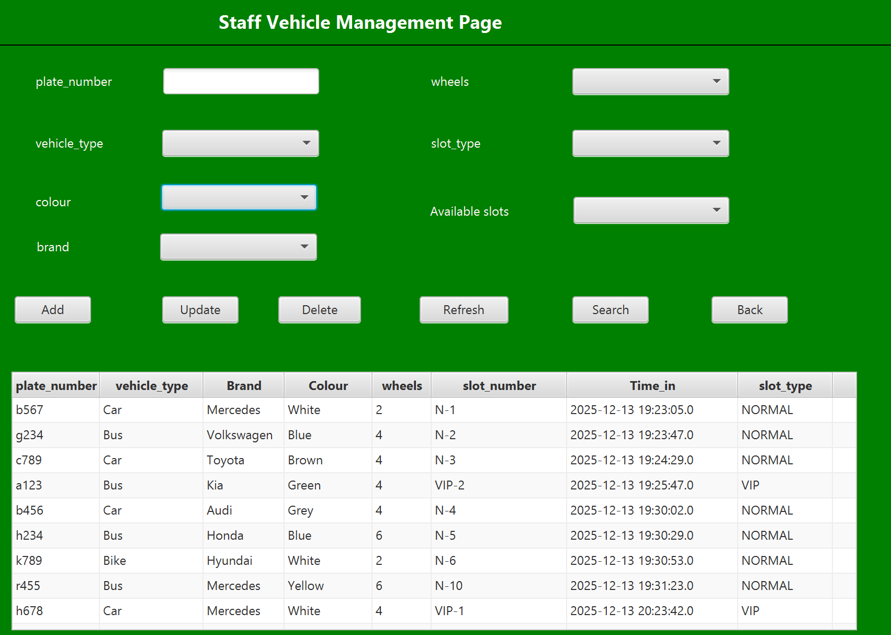
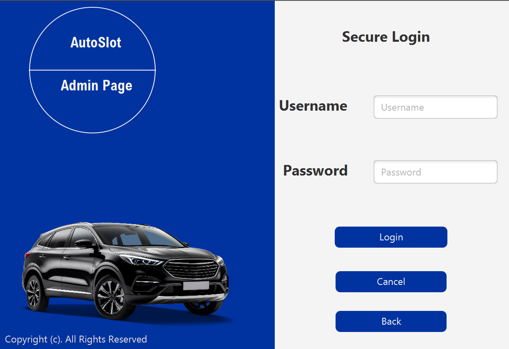
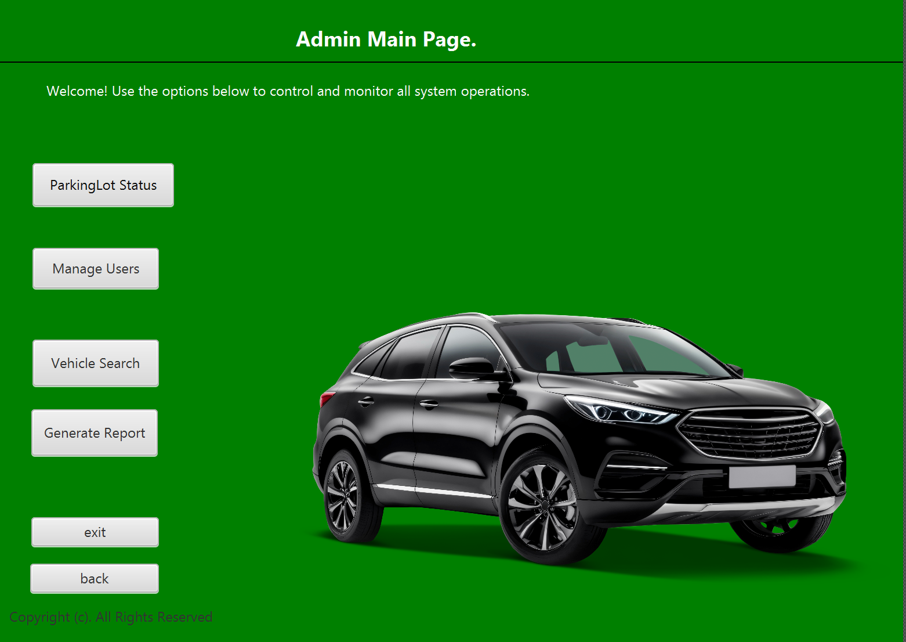

## Project Overview:
The Car Park Management System (CPMS) is a desktop application built using JavaFX and MySQL.It allows staff to register vehicles, assign parking slots, and manage check-in/check-out, while administrators can search records and generate reports (daily, weekly, yearly).
The system is designed as a free parking system, focusing on simplicity, reliability, and clean database relationships.
The system replaces manual parking records with an automated solution that ensures accurate tracking of vehicles, parking slots and usage statistics in real time.
The parking system is intentionally designed as a frees parking system in order to focus on core operational logic such as vehicle registration, slot allocation , reporting and as well quick retrival of specific vehicle information from the system. The system supports two distinct user roles : staff and Admin, each with separate responsibilities. Staff members are responsible for day to day parking operations including vehicle check-in, parkkng slot allocation, record updates and vehicle check-out.On the other hand, Administrators focus on monitoring and analysis, with access to vehicle searches, parking status overviews and statistical reports.

## User Roles Overview
- Staff
  - Register vehicles
  - Assign parking slots
  - Update Vehicle Information
  - Checkout Vehicles 
- Admin 
  - Search vehicles
  - View parking status
  - edit information about staff and admin
  - Generate daily, weekly, and yearly reports

## Application Pages and Workflow
- Below is a step-by-step explanation of each page in the system.

## 1. Role Selection Page:
Allows the user to choose whether they are logging in as ADMIN or STAFF.

## Role based logic
- This page acts as the entry point to the system. Based on the selected role, the user is directed to the appropriate login page. This ensures role separation from the start of the application.The cancel button exits the system.

````java
public class RoleSelectionController {

    @FXML
    private void onAdminClick(ActionEvent event) throws IOException {
        switchScene(event, "/com/example/demo/AdminLogin.fxml");
    }

    @FXML
    private void onStaffClick(ActionEvent event) throws IOException {
        switchScene(event, "/com/example/demo/StaffLogin.fxml");
    }

    //cancel button
    @FXML
    private void onCancel(ActionEvent event) {
        Stage stage = (Stage) ((Node) event.getSource())
                .getScene()
                .getWindow();
        stage.close();   // clean exit
    }

````
The image below shows the User role Page.





## 2. Staff Login Page
- Authenticates staff members before granting access to parking management features.

## Staff login Logic
- Allows user to access the system provided they have entered credentials similar to the ones in the database.

````java
public void validateLogin() {
DatabaseConnection connectNow = new DatabaseConnection();
Connection connectDB = connectNow.getConnection();

        String sql = "SELECT Role FROM useraccounts WHERE Username = ? AND Password = ?";

        try {
            PreparedStatement ps = connectDB.prepareStatement(sql);
            ps.setString(1, usernametextfield.getText());
            ps.setString(2, passwordfield.getText());

            ResultSet rs = ps.executeQuery();

            if (rs.next()) {
                String role = rs.getString("Role");

                // ✔ Admin and Staff both allowed
                if (role.equalsIgnoreCase("Admin") || role.equalsIgnoreCase("Staff")) {

                    loginlabel.setText("Login Successful!");

                    // TODO: Load staff dashboard here

                } else {
                    loginlabel.setText("ACCESS DENIED.");
                }

            } else {
                loginlabel.setText("Invalid username or password.");
            }

        } catch (Exception e) {
            e.printStackTrace();
        }
    }
````

    

    
Below is the user accounts database with login details for both Admins and Staff. Both Admins and Staff members are allowed to access the Staff Login Page with their login details.





Below is the Staff Loin Page:





Staff members enter their credentials to access the system. Upon successful authentication, they are redirected to the Staff Vehicle management Page.

## Page switch Logic

````java
@FXML
private void onLoginClick(ActionEvent event) throws IOException {
Parent root = FXMLLoader.load(getClass().getResource("/com/example/demo/StaffVehicleManagement.fxml"));
Stage stage = (Stage) ((Node) event.getSource()).getScene().getWindow();
Scene scene = new Scene(root);
stage.setScene(scene);
stage.sizeToScene();
stage.show();
}

````

## 3. Staff Vehicle management Page
- This is the main operational page where staff manage vehicle parking.

- Below is the staff vehicle management page



## Logic about vehicle information
- The system uses comboboxes to allow user to easily choose within the given criteria.

````java
 @FXML
    public void initialize() {

        vehicleTypeBox.setItems(FXCollections.observableArrayList("Car","Bus","Bike","Truck"));
        brandBox.setItems(FXCollections.observableArrayList(
                "BMW","Mercedes","Audi","Toyota","Volkswagen",
                "Honda","Ford","Hyundai","Kia","Nissan"
        ));
        colourBox.setItems(FXCollections.observableArrayList(
                "Black","White","Silver","Grey","Blue",
                "Red","Green","Brown","Yellow","Orange"
        ));
        wheelsBox.setItems(FXCollections.observableArrayList(2,4,6));
        slotTypeBox.setItems(FXCollections.observableArrayList("VIP","NORMAL"));
````
- ADD Button Logic: 
  - Registers new vehicle
  - Assigns parking slot
  - Prevents deplicate plate numbers

````java
 PreparedStatement vStmt = conn.prepareStatement(
                    "INSERT INTO vehicles (plate_number, vehicle_type, brand, colour, wheels) VALUES (?,?,?,?,?)",
                    PreparedStatement.RETURN_GENERATED_KEYS
            );
            vStmt.setString(1, plateField.getText());
            vStmt.setString(2, vehicleTypeBox.getValue());
            vStmt.setString(3, brandBox.getValue());
            vStmt.setString(4, colourBox.getValue());
            vStmt.setInt(5, wheelsBox.getValue());
            vStmt.executeUpdate();

````
- UPDATE Button Logic:
  - Staff can click a record to autofill form fields
  - Modify only selected fields, there is no need to re-enter everything

````java
DatabaseConnection db = new DatabaseConnection();

        try (Connection conn = db.getConnection()) {

            PreparedStatement stmt = conn.prepareStatement(
                    "UPDATE vehicles SET vehicle_type=?, brand=?, colour=?, wheels=? WHERE plate_number=?"
            );
            stmt.setString(1, vehicleTypeBox.getValue());
            stmt.setString(2, brandBox.getValue());
            stmt.setString(3, colourBox.getValue());
            stmt.setInt(4, wheelsBox.getValue());
            stmt.setString(5, v.getPlateNumber());

            stmt.executeUpdate();

            onRefresh();

        } catch (Exception e) {
            e.printStackTrace();
        }
    }
````
- DELETE Button Logic:
  - Deletes(checkout) a selected record in the database and on the tableview as well and updates the slots in the table .

```java
 DatabaseConnection db = new DatabaseConnection();

        try (Connection conn = db.getConnection()) {


PreparedStatement findStmt = conn.prepareStatement("""
            SELECT s.session_id, s.slot_id
            FROM parking_sessions s
            JOIN vehicles v ON s.vehicle_id = v.vehicle_id
            WHERE v.plate_number = ? AND s.time_out IS NULL
        """);
            findStmt.setString(1, v.getPlateNumber());

ResultSet rs = findStmt.executeQuery();
            if (!rs.next()) {
showAlert("Active parking session not found.");
                return;
                        }

int sessionId = rs.getInt("session_id");
int slotId = rs.getInt("slot_id");


PreparedStatement closeSession = conn.prepareStatement(
        "UPDATE parking_sessions SET time_out = NOW() WHERE session_id = ?"
);
            closeSession.setInt(1, sessionId);
            closeSession.executeUpdate();


PreparedStatement freeSlot = conn.prepareStatement(
        "UPDATE parking_slots SET status = 'FREE' WHERE slot_id = ?"
);
            freeSlot.setInt(1, slotId);
            freeSlot.executeUpdate();
            
````

- REFRESH Button 
  - Reloads table and available slots

- Table displays





## 4. Admin Login Page
User enters their login credentials and are directed to the Admin Main page.Only allows Admins to enter not Staff.





## 5. Admin Main Page
Allows Admin navigation to vehicle Search, Parking Lot Status, Reports and user management.




## 5. Parking Lot Status Page
Provides a visual overview of parking slot occupancy, displaying available slots and occupied slots.


Vehicle Search Page
Manage Users Page
Reports Page


